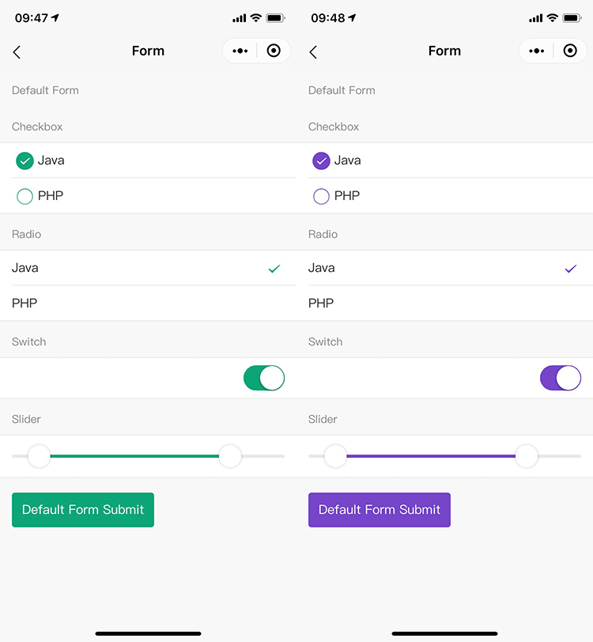

# 量身定制

`Wux Weapp` 支持量身定制功能，轻松适应不同的设计风格，满足移动端开发的基本需求。

## 定制主题

`Wux Weapp` 设计规范和技术上支持灵活的样式定制，以满足业务和品牌上多样化的视觉需求，包括但不限于全局样式（主色、圆角、边框）和指定组件的视觉定制。



### 样式变量

`Wux Weapp` 的样式使用了 [Less](http://lesscss.org/) 作为开发语言，并定义了一系列全局/组件的样式变量，你可以根据需求进行相应调整。

以下是一些最常用的通用变量，所有样式变量可以在 [default.less](https://github.com/wux-weapp/wux-weapp/tree/master/src/styles/themes/default.less) 找到。

```css
// -------- Colors -----------
@light: #fff;
@stable: #f8f8f8;
@positive: #387ef5;
@calm: #11c1f3;
@balanced: #33cd5f;
@energized: #ffc900;
@assertive: #ef473a;
@royal: #886aea;
@dark: #444;
@light-inverse: #ddd;
@stable-inverse: #b2b2b2;

// Base Scaffolding Variables
@font-size-base: 14px; // 主字号
@heading-color: rgba(0, 0, 0, 0.85); // 标题色
@text-color: rgba(0, 0, 0, 0.65); // 主文本色
@text-color-secondary: rgba(0, 0, 0, 0.45); // 次文本色
@border-radius-base: 4px; // 组件/浮层圆角
@border-color-base: #d9d9d9; // 边框色
@opacity-disabled: 0.3; // 禁用态透明度
@active-state-bg: #ececec; // 点击态背景色
```

如果以上变量不能满足你的定制需求，可以给我们提 [Issue](https://github.com/wux-weapp/wux-weapp/issues)。

## 定制组件

可自由选择所需的组件进行打包，以下是一些最常用的组件，所有组件可以在 [config.json](https://github.com/wux-weapp/wux-weapp/tree/master/scripts/config.json) 找到。

- [x] accordion
- [x] actionsheet
- [x] alert
- [x] animation-group
- [x] avatar
- [x] backdrop
- [x] button
- [x] icon

## 定制方式

原理上是使用 `Less` 提供的 [modifyVars](http://lesscss.org/usage/#using-less-in-the-browser-modify-variables) 的方式进行覆盖变量。下面将针对不同的场景提供一些常用的定制方式。

### 如何使用

以下是一个定制的典型例子，对 `config.json` 的 `components`, `themes` 属性进行相应配置。

- `themes` 参考 [default.less](https://github.com/wux-weapp/wux-weapp/tree/master/src/styles/themes/default.less) 进行主题定制化配置。
- `components` 参考 [config.json](https://github.com/wux-weapp/wux-weapp/tree/master/scripts/config.json) 进行组件定制化配置。

!> 注意：编译完成后在对应的目录可以找到定制后的文件（此示例为 `./build` 目录）。

编译命令如下：

```bash
# 克隆项目到本地，或手动下载也可
git clone https://github.com/wux-weapp/wux-weapp.git

# 进入项目根目录
cd wux-weapp

# 新建一个配置文件，若已创建可忽略此步骤
touch config.custom.json

# 安装依赖包
npm install

# 编译文件
npm run build -- --config ./config.custom.json --output ./build
```

config.custom.json 格式如下：

```json
{
  "components": ["accordion"],
  "themes": {
    "light": "white"
  }
}
```

### 相关命令

| `npm run <script>` | 描述                                                                              |
| ------------------ | --------------------------------------------------------------------------------- |
| `build`            | 编译程序到 `packages` 目录下（`build:core`、 `build:es`、`build:lib` 合集）。     |
| `build:core`       | 编译程序到 `packages/core` 目录下（未编译 `Less` 版，仅用于编译 `es` 与 `lib`）。 |
| `build:es`         | 编译程序到 `packages/es` 目录下（未压缩 `ES6` 版）。                              |
| `build:lib`        | 编译程序到 `packages/lib` 目录下（压缩 `ES5` 版）。                               |
| `start`            | 编译程序到 `example/dist` 目录下（仅用于 `demo` 使用）。                          |

- `--config` 自定义配置文件路径。如 `npm run build -- --config path/to/config.custom.js`
- `--output` 自定义输出文件目录。如 `npm run build -- --output path/to/build`
